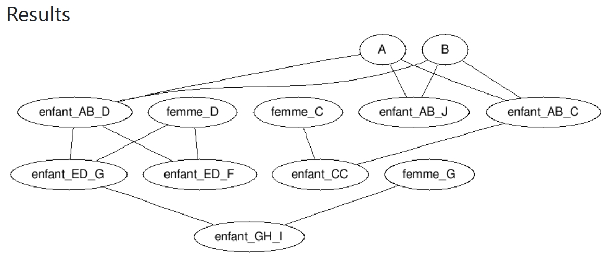

# Projet MCDUCK-PIPOO 

## Compilation w/ makefile
```sh
$ gcc -std=c99 -Wall -pedantic src/main.c -o main.out src/mcduck.c src/node.c src/tree.c
or 
$ make -f MakeFile 
```
## Execution
```sh
$ ./main
```
Create a duck
```c
Duck create_duck(char*, char*, char*);
```
Initiate the family members tree from root node
```c
Tree init_tree(Duck);
```
Add a sibling  
```c
void add_sibling(Tree, Duck, Duck); 
```
Add a child 
```c
void add_child(Tree, Duck, Duck, Duck);
```
Proceed to wedding two family members
```c
void the_wedding_present(Tree, Duck, Duck); 
```
Search for a specific duck  
```c
void search(Tree, Duck, bool(*)(void*,void*),Duck);
```
Output the sub-family members
```c
void show(Tree, Duck);
```
Delete sub-family members from node 
```c
void delete_from_node(Tree, Duck); 
```
Search for a node through all the tree  
```c
void global_search(Tree, Duck); 
```
You can define the type of the data stored in the list by modifying
```c
typedef family_member gen_t; 
```
at the begining of the file.

Important : généricité non traitée de manière exhaustive car partielle en C (!= cpp templates). 

### Current output of the main() function:
```bash
==STRUCTURE OF THE TREE==
0 Name: A			    Parents: NULL & NULL
1 Name: B			    Parents: NULL & NULL
2 Name: enfant_AB_C		Parents: A & B
3 Name: enfant_AB_D		Parents: A & B
4 Name: femme_D			Parents: NULL & NULL
5 Name: enfant_ED_F		Parents: enfant_AB_D & femme_D
6 Name: enfant_ED_G		Parents: enfant_AB_D & femme_D
7 Name: femme_G			Parents: NULL & NULL
8 Name: enfant_GH_I		Parents: enfant_ED_G & femme_G

==SHOW PART==
A ------- B
 (enfant_AB_C ------- femme_C
   ( enfant_CC ) enfant_AB_D ------- femme_D
     ( enfant_ED_F , enfant_ED_G ------- femme_G
       ( enfant_GH_I ) )  enfant_AB_J ) 

==SEARCH PART==
, "," enfant_GH_I

==GLOBAL SEARCH PART==
ROOT MEMBER: A
ROOT MEMBER: B
, "," enfant_ED_G
```

## Graphviz rendering (w.r.t 2 root members)
